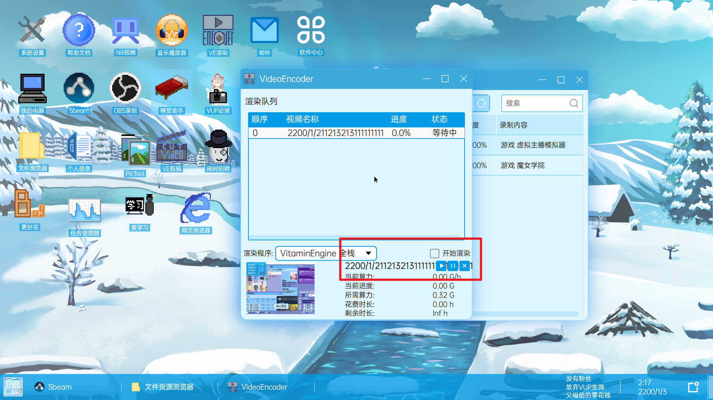
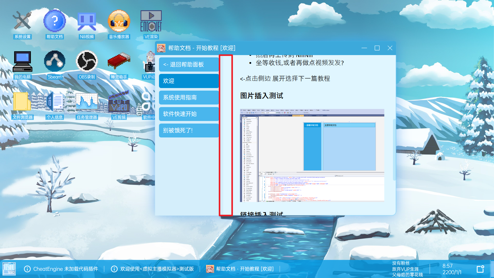

# BUG

## 操作系统

### steam浮窗显示异常

用steam启动游戏，出现右下角这种情况，按下shift+tab访问社区出现如屏幕中间那一块一点点的社区，然后中间游戏内的按键就没法点击了。再次shift+tab关闭社区，可以点击游戏内按键。重启游戏后任然有同样情况。

### 提示的优先级

刚打开的时候，这里后面的那个提示应该是最前面的吧？

### 创建快捷方式图标重合

em，如下图，叠高高~

### 关于的名单

点击了没有什么反应，看下面一行小字应该已经有名单了才对呀？

### 主题更换

一开始是**原版默认**，修改为**混色紫**，再改回**原版默认**是没有问题的;
一开始是**原版默认**，修改为**默认虚拟主播风格**，再改回**原版默认**，主题一直是**默认虚拟主播风格**，多次来回点，也没有变化，直到点了**混色紫**，图标变成原来的了
测试**混合紫**的情况，是正常的。

然后任务栏这里的图标好像没换成主题的图标呢，点击一次图标后，换为主题的图标了。

## 文件资源管理器

### 搜索框

这里的搜索框是还没有功能吗？尝试了回车和点击搜索按钮，搜索文件夹也搜不到，搜索物品好像也没有搜到。
另外希望可以给搜索框那个放大镜按钮增加点击反馈(点了都不知道有没有点。。)

### 固定到快捷菜单

这个快捷菜单是左边这个区域吗？点了固定但是没找到固定到哪里去了。。还是说还没有做呢？

### 名称标签详细

视频名称修改长了就变成这样了。连带着其他的会显示视频名称的地方都有些异常。
建议可以修改名称的地方都适当加上长度限制。

## NiliNili视频

### 给视频和评论点赞

一开始点赞数是7，给下面评论点了赞之后，视频的点赞多了1，此时视频的点赞为8，点赞按钮是白色的，点击视频的点赞按钮后，视频的点赞数反而-1，视频点赞数变成了7

### 点赞数不匹配

视频播放页面的点赞数和主页显示的点赞数不匹配

### 动态,评论消失

退出Nili，重开后动态评论什么的都没了

### 可能是没有做的功能

消息和收藏点击没反应

评论的种种，好像都还没做好

## Sbeam

### 窗口最大化

第一次打开后点击最大化，窗口没有最大化而是跑左上角去了，此时最大化的按钮为向下还原的按钮，再次点击这里，放大了，但是没有完全放大，还有很多缝隙。
之后再次点击放大缩小，效果正常，没有出现跑到左上角的情况，就是最大化有缝。

### 精选和推荐

下图的控件好像效果不是很正常，而且这里就2个游戏？点后面3个都是魔女学院的介绍。自动跳转也只会跳转前面2个。

### 可能是没有做的功能

已有游戏的评测，下图内容点击没反应。

点击标签没反应

# 建议

## 刚修改分辨率后的窗口位置

默认1280*720分辨率窗口位置正常，修改为其他分辨率后希望可以让这些窗口自动居中。(没有重启的情况下)
重启之后窗口是在合适位置的。

## 登录界面增加退出游戏的按钮

希望可以在登录界面的合适位置增加退出游戏的按钮

## 初始物品的语言

也许应该给出中文的，以及给出性能的条条和分数，就算不是直接显示在下面的列表里面，也可以鼠标悬浮在相应设备名上后显示。
这样对于这些设备不是很了解的玩家也比较友好（就算是我这样一个喜欢玩游戏的也许也只是认识下面图片的cpu，gpu...）

类似于人物属性这样，给出详细的介绍，不是也挺好。

## 难度剧情？

不应该是剧情难度吗？
在剧本选择的下拉框下面其实可以看到已经有难度的显示了，其实就没有必要再在人物生平中写上这一行了，有家教的富二代那里因为太长了，难度都换行了...。
然后左边的难度提示可以稍微更明显一点。

## 文档侧边列表

没有展开的时候有个向右的箭头，展开了是不是也可以有个向左收起列表的按键呢？
虽然我试出来点击左边任意非按键的位置会收起列表。

## VOS软件快速介绍

点击帮助文档里面的这个关于软件的快速介绍会弹出反馈中心，而不是跳到介绍页面。

## 帮助文档图片

也许可以稍微提高下画质？

也许可以让其和windows的图片播放器一样，最大化不是直接拉伸满整个屏幕？而是保持图片比例的情况下放大，然后多余位置显示空白的。

## 帮助文档打开后，自动暂停时间

也许在帮助文档打开的时候可以自动暂停时间？特别是刚开始玩的时候，需要了解下怎么游玩这个游戏，看着文档天都快黑了=w=
然后关闭文档可以自动开始时间。

## 图标自动对齐网格

目前只有右键图标才有与网格对齐，希望可以在空白处右键可以让所有图标都进行整理。
也许可以像windows那样选择图标？ctrl，shift，左键拖选？
甚至可以创建桌面图标的快照，进行恢复归位？比如在系统设置里面可以初始化图标的位置？或者用户自己可以创建快照，自己恢复想要的图标位置？

## 音乐播放器进度条

也许可以给个进度条，允许拖拽？还是说我没找到吗....

## Nili视频搜索框

也许可以进行名字的搜索？

## 吃食物过程

希望可以给吃食物增加一定的反馈，点下去就没了，也许有个动画？有个提示？

